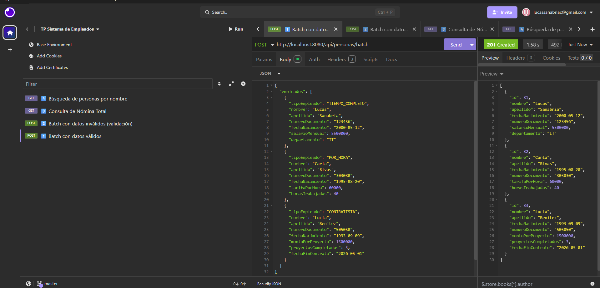
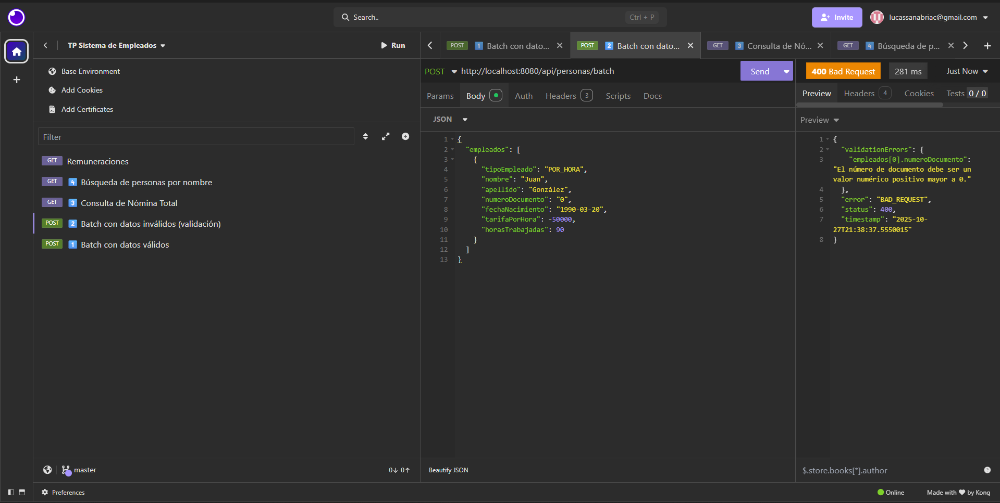
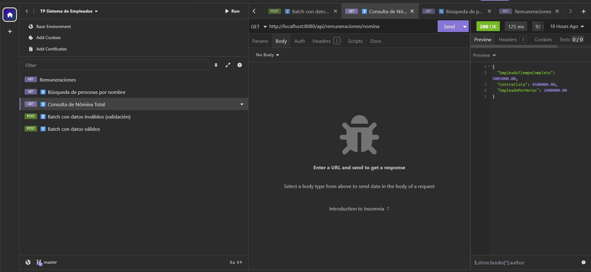
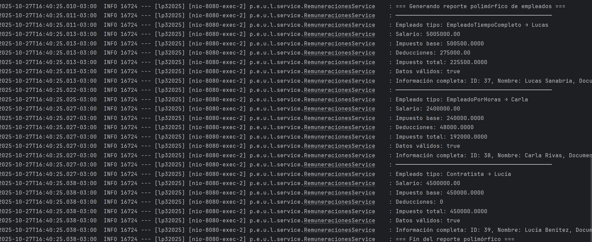

# 📘 Proyecto: Sistema de Empleados — Lenguaje de Programación 3

## 🧩 Descripción General
Aplicación desarrollada con **Spring Boot** y **JPA/Hibernate**, utilizando **H2 Database** como base de datos embebida.  
Permite gestionar empleados de diferentes tipos (**Tiempo Completo**, **Por Horas** y **Contratistas**) aplicando **herencia JPA** y **polimorfismo** en los cálculos de salarios e impuestos.

---

## ⚙️ Instrucciones de Ejecución

### 🔹 1. Requisitos previos
- Java 17 o superior  
- Maven 3.8+  
- IntelliJ IDEA / Eclipse / VSCode con soporte Spring Boot

### 🔹 2. Clonar y ejecutar
```bash
git clone https://github.com/LucasMati/lucassanabria-tp-lp3-2025.git
cd lp32025
mvn spring-boot:run
```

### 🔹 3. Acceso a la consola H2
- URL: [http://localhost:8080/h2-console](http://localhost:8080/h2-console)
- JDBC URL: `jdbc:h2:file:C:/db/lp32025`
- Usuario: `sa`
- Contraseña: `password`

---

## 🏗️ Arquitectura Implementada

### 🔸 Capas principales:
| Capa | Descripción |
|------|--------------|
| **Controller** | Expone los endpoints REST (sin lógica de negocio). |
| **Service** | Contiene la lógica de validación, persistencia y cálculo. |
| **Repository** | Maneja la comunicación con la base de datos usando JPA. |
| **Domain** | Define las entidades con herencia y polimorfismo. |
| **DTO / Exception / Handler** | Gestiona respuestas y errores globales. |

### 🔸 Herencia y Polimorfismo
- `Persona` → clase abstracta base con métodos polimórficos (`calcularSalario`, `calcularDeducciones`, `validarDatosEspecíficos`)
- Subclases:
  - `EmpleadoTiempoCompleto`
  - `EmpleadoPorHoras`
  - `Contratista`

### 🔸 Manejo de excepciones
- `BusinessException` y `NotFoundException` para reglas de negocio.  
- `GlobalExceptionHandler` con `@ControllerAdvice` para capturar errores globalmente.  
- Respuestas unificadas con `BaseResponseDto`.

---

## 🧠 Ejemplos de Comandos cURL

### ✅ 1. Operación Batch con Datos Válidos
```bash
curl -X POST http://localhost:8080/api/personas/batch -H "Content-Type: application/json" 
-d '{
  "empleados": [
    {
      "tipoEmpleado": "TIEMPO_COMPLETO",
      "nombre": "Lucas",
      "apellido": "Sanabria",
      "numeroDocumento": "123456",
      "fechaNacimiento": "2000-05-12",
      "salarioMensual": 5500000,
      "departamento": "IT"
    },
    {
      "tipoEmpleado": "POR_HORA",
      "nombre": "Carla",
      "apellido": "Rivas",
      "numeroDocumento": "303030",
      "fechaNacimiento": "1995-08-20",
      "tarifaPorHora": 60000,
      "horasTrabajadas": 40
    },
    {
      "tipoEmpleado": "CONTRATISTA",
      "nombre": "Lucía",
      "apellido": "Benítez",
      "numeroDocumento": "505050",
      "fechaNacimiento": "1993-09-09",
      "montoPorProyecto": 1500000,
      "proyectosCompletados": 3,
      "fechaFinContrato": "2026-05-01"
    }
  ]
}'
```

### ❌ 2. Operación Batch Inválida (falla validación)
```bash
curl -X POST http://localhost:8080/api/personas/batch -H "Content-Type: application/json" -d '{
  "empleados": [
    {
      "tipoEmpleado": "POR_HORA",
      "nombre": "Juan",
      "apellido": "González",
      "numeroDocumento": "111111",
      "fechaNacimiento": "1990-03-20",
      "tarifaPorHora": -50000,
      "horasTrabajadas": 90
    }
  ]
}'
```

### 📊 3. Consulta de Nómina Total
```bash
curl -X GET http://localhost:8080/api/remuneraciones/nomina
```

### 🔍 4. Filtro de Personas por Nombre
```bash
curl -X GET "http://localhost:8080/api/personas?nombre=lucas"
```

---

## 🧾 Capturas de Pantalla

📸 **1. Operación batch exitosa**  


📸 **2. Error de validación de lote**  


📸 **3. Consulta de nómina total (GET /remuneraciones/nomina)**  


📸 **4. Reporte de polimorfismo (Salida de consola)**  


---

